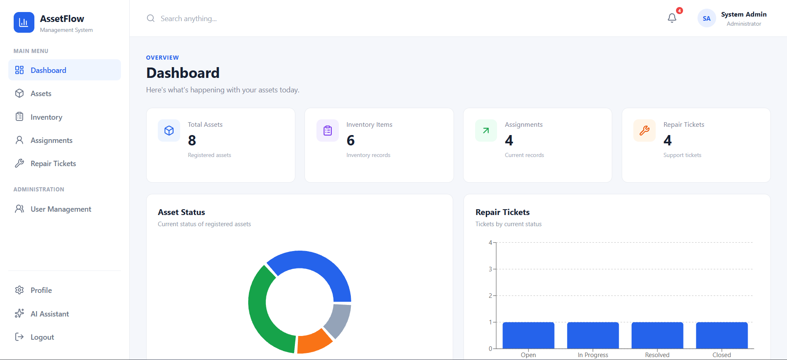
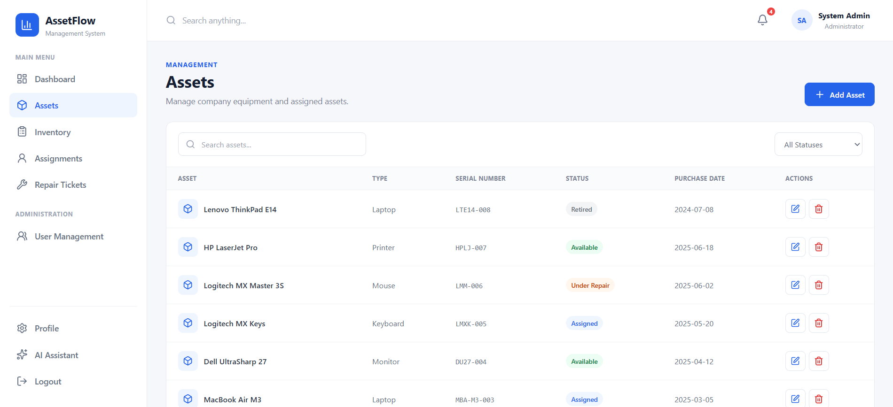
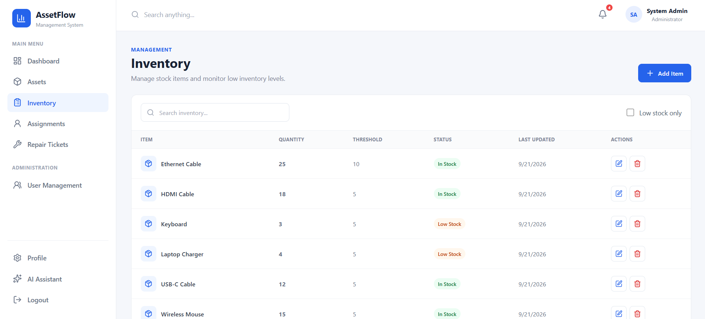
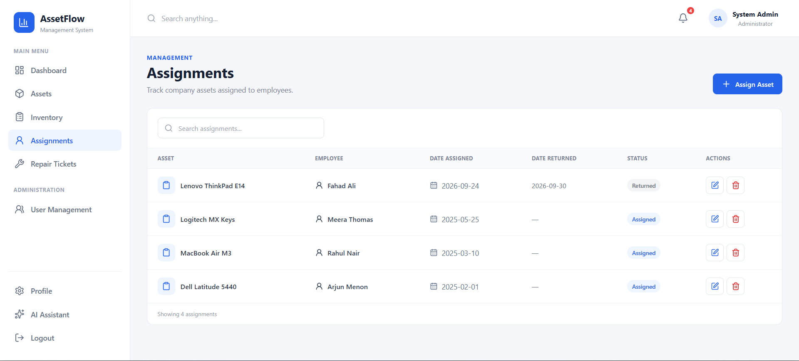
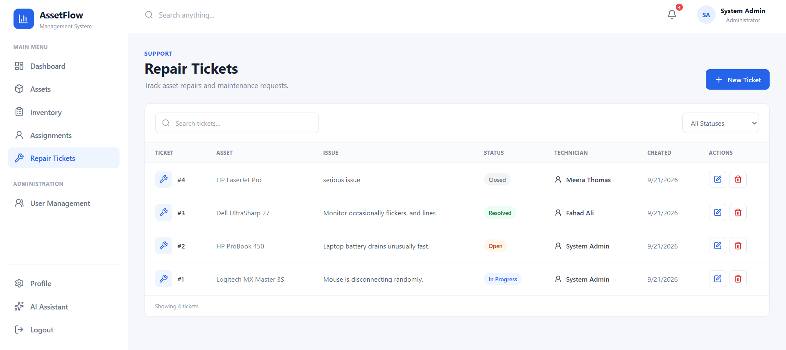
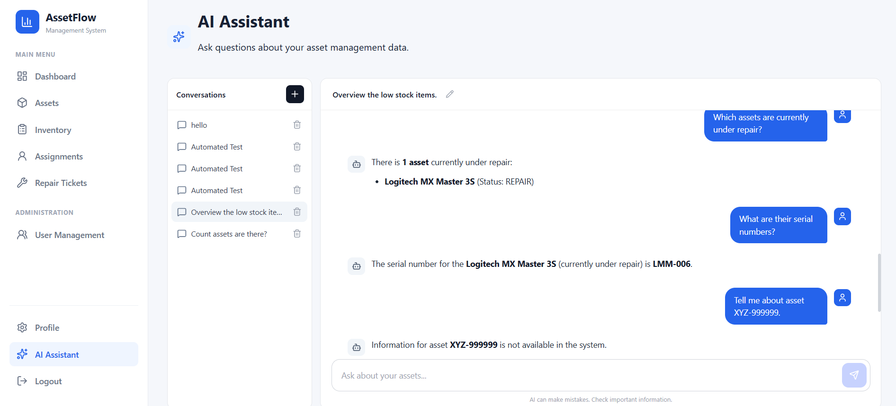
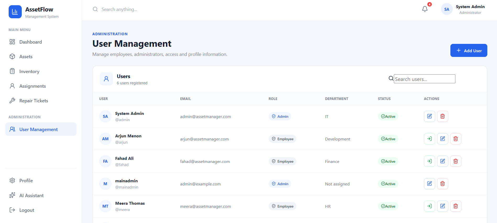

<div align="center">

# 🚀 Asset Management System

### A modern full-stack platform for managing assets, inventory, assignments, repairs, users, and AI-assisted operations.

Built with **Django REST Framework + React** and deployed with **Docker + NGINX + Render**.

<br>

<a href="https://asset-management-frontend-m8sg.onrender.com">
  
</a>
&nbsp;
<a href="https://asset-management-system-npgv.onrender.com">
  
</a>
&nbsp;
<a href="https://github.com/atkswalih/asset-management-system">
  
</a>

<br><br>


<br><br>



</div>

---

## ✨ Overview

**Asset Management System** is a full-stack asset operations platform designed to provide organizations with a centralized system for managing equipment, inventory, employees, assignments, maintenance workflows, repair tickets, and users.

The platform covers the complete asset lifecycle:

```text
┌──────────┐
│ Register │
└────┬─────┘
     ↓
┌──────────┐
│  Track   │
└────┬─────┘
     ↓
┌──────────┐
│  Assign  │
└────┬─────┘
     ↓
┌──────────┐
│ Maintain │
└────┬─────┘
     ↓
┌──────────┐
│  Repair  │
└────┬─────┘
     ↓
┌──────────┐
│ Monitor  │
└──────────┘
```

It combines business workflows with:

* 🤖 Integrated AI assistant
* 🔐 JWT authentication
* 👥 Role-based authorization
* 🔄 User impersonation
* 📦 Inventory management
* 🛠️ Repair ticket workflows
* 🚀 Production deployment infrastructure

---

## 🌐 Live Demo

| Service             | URL                                                           |
| ------------------- | ------------------------------------------------------------- |
| 🌐 **Frontend**     | https://asset-management-frontend-m8sg.onrender.com           |
| ⚡ **Backend API**   | https://asset-management-system-npgv.onrender.com             |
| ❤️ **Health Check** | https://asset-management-system-npgv.onrender.com/api/health/ |

> **Note:** The backend runs on Render's free tier and may take a few seconds to wake up after inactivity.

---

# 🖥️ Application Preview

<table>
<tr>

<td width="50%" valign="top">

### 📊 Dashboard


</td>

<td width="50%" valign="top">

### 💻 Asset Management



</td>

</tr>

<tr>

<td width="50%" valign="top">

### 📦 Inventory



</td>

<td width="50%" valign="top">

### 👤 Assignments



</td>

</tr>

<tr>

<td width="50%" valign="top">

### 🔧 Repair Tickets



</td>

<td width="50%" valign="top">

### 🤖 AI Assistant



</td>

</tr>

<tr>

<td width="50%" valign="top">

### 👥 User Management



</td>

<td width="50%" valign="top">

### 🚀 Production Ready

Full-stack application deployed with Docker, NGINX and Render.

</td>

</tr>
</table>

---

# ⭐ Key Features

<table>
<tr>

<td width="33%" align="center">

### 📦 Asset Management

Create, update, track and manage organizational assets.

</td>

<td width="33%" align="center">

### 📊 Inventory

Monitor inventory items, stock levels and availability.

</td>

<td width="33%" align="center">

### 👤 Assignments

Assign assets to employees and track ownership.

</td>

</tr>

<tr>

<td width="33%" align="center">

### 🔧 Repair Tickets

Manage damaged assets and maintenance workflows.

</td>

<td width="33%" align="center">

### 🤖 AI Assistant

Integrated AI-powered assistant for interacting with the system.

</td>

<td width="33%" align="center">

### 🔐 Authentication

JWT-based authentication with protected API endpoints.

</td>

</tr>

<tr>

<td width="33%" align="center">

### 👥 User Management

Manage employees, administrators and system users.

</td>

<td width="33%" align="center">

### 🔄 Impersonation

Authorized administrators can operate through user accounts when required.

</td>

<td width="33%" align="center">

### 📱 Responsive UI

Modern React interface designed for different screen sizes.

</td>

</tr>
</table>

---

# 🧩 Core Modules

| Module                | Purpose                                          |
| --------------------- | ------------------------------------------------ |
| 📦 **Assets**         | Manage organizational assets and their lifecycle |
| 📊 **Inventory**      | Track stock and inventory items                  |
| 👤 **Assignments**    | Assign assets to employees                       |
| 🔧 **Repair Tickets** | Track damaged assets and repairs                 |
| 👥 **Users**          | Manage users and roles                           |
| 🤖 **AI Assistant**   | AI-powered system assistance                     |
| 🔐 **Authentication** | Secure JWT authentication                        |
| 🛡️ **Authorization** | Role-based access control                        |
| 📈 **Dashboard**      | Centralized operational overview                 |

---

# 🏗️ Architecture

```text
                        ┌──────────────────────┐
                        │       Browser        │
                        │    React + Vite      │
                        └──────────┬───────────┘
                                   │
                                   │ HTTP / REST
                                   ▼
                        ┌──────────────────────┐
                        │        NGINX         │
                        │   Reverse Proxy      │
                        └──────────┬───────────┘
                                   │
                                   ▼
                        ┌──────────────────────┐
                        │   Django REST API    │
                        │      Backend         │
                        └──────────┬───────────┘
                                   │
                    ┌──────────────┼──────────────┐
                    │              │              │
                    ▼              ▼              ▼
              ┌──────────┐  ┌──────────┐  ┌──────────────┐
              │PostgreSQL│  │   JWT    │  │ AI Assistant │
              │ Database │  │   Auth   │  │    Service   │
              └──────────┘  └──────────┘  └──────────────┘
```

---

# 🔐 Authentication Flow

The application uses JWT-based authentication.

```text
User
  │
  ▼
Login
  │
  ▼
Django Authentication
  │
  ▼
JWT Access + Refresh Tokens
  │
  ▼
Protected API Requests
  │
  ▼
Role-Based Authorization
```

Protected resources are accessible according to the authenticated user's permissions.

---

# 🤖 AI Assistant

The platform includes an integrated AI assistant designed to provide contextual assistance within the asset management environment.

The assistant is accessible directly from the application interface and provides an additional natural-language interaction layer alongside the traditional dashboard workflows.

---

# 🛠️ Tech Stack

### Frontend


### Backend


### Database


### Infrastructure


---

# 📁 Project Structure

```text
asset-management-system/
│
├── backend/
│   ├── assets/
│   ├── config/
│   ├── manage.py
│   ├── requirements.txt
│   └── Dockerfile
│
├── frontend/
│   ├── src/
│   │   ├── components/
│   │   ├── pages/
│   │   ├── services/
│   │   └── App.jsx
│   │
│   ├── public/
│   ├── package.json
│   └── Dockerfile
│
├── docs/
│   └── screenshots/
│       ├── dashboard.png
│       ├── assets.png
│       ├── inventory.png
│       ├── assignments.png
│       ├── tickets.png
│       ├── ai-assistant.png
│       └── users.png
│
├── README.md
└── docker-compose.yml
```

---

# 🚀 Getting Started

## 1. Clone the repository

```bash
git clone https://github.com/atkswalih/asset-management-system.git
cd asset-management-system
```

## 2. Backend setup

```bash
cd backend

python -m venv venv
```

### Windows

```bash
venv\Scripts\activate
```

### Install dependencies

```bash
pip install -r requirements.txt
```

### Run migrations

```bash
python manage.py migrate
```

### Start Django

```bash
python manage.py runserver
```

---

## 3. Frontend setup

Open another terminal:

```bash
cd frontend
npm install
npm run dev
```

The frontend will be available through the Vite development server.

---

# 🔌 API

### Authentication

```text
POST /api/auth/login/
POST /api/auth/refresh/
GET  /api/auth/me/
```

### Health Check

```text
GET /api/health/
```

### Application API

```text
/api/
```

The API provides endpoints for the application's asset, inventory, assignment, repair, user and related workflows.

---

# 🚢 Deployment

The production architecture uses:

```text
React
  ↓
Vite Build
  ↓
NGINX
  ↓
Render
  ↓
Django REST API
  ↓
PostgreSQL
```

The frontend and backend are deployed separately, with NGINX handling frontend delivery and API reverse-proxying.

---

# 🛡️ Security

The project includes several security-oriented practices:

* JWT authentication
* Protected API endpoints
* Role-based authorization
* Django security middleware
* Environment-based configuration
* Server-side validation
* Controlled user impersonation
* Production-ready reverse proxy configuration

---

# 📚 What This Project Demonstrates

This project demonstrates practical experience with:

* Full-stack application architecture
* REST API development
* React frontend development
* Django backend development
* Database-driven applications
* JWT authentication
* Role-based authorization
* CRUD workflows
* Asset lifecycle management
* AI integration
* Docker containerization
* NGINX configuration
* Production deployment
* Git and GitHub workflows
* Debugging deployed applications

---

# 🗺️ Roadmap

Potential future improvements:

* [ ] Advanced analytics dashboard
* [ ] Asset history timeline
* [ ] Email notifications
* [ ] Automated maintenance reminders
* [ ] Advanced reporting
* [ ] Audit logs
* [ ] More AI-powered workflows
* [ ] Automated testing suite
* [ ] CI/CD pipeline

---

# 👨‍💻 Author

<div align="center">

### Mohamed Swalih

Full Stack Python Developer · AI Application Developer

<a href="https://github.com/atkswalih">
  
</a>

</div>

---

<div align="center">

### ⭐ If you found this project interesting, consider giving it a star.

Built with ❤️ using **Python, Django, React and modern web technologies.**

</div>
